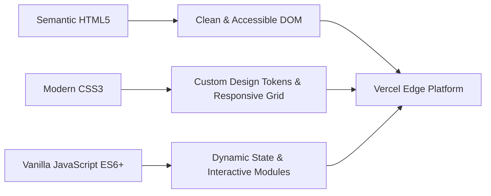

# 🍻 Big Hammock Brewery & Bites — Official Web Platform

[](https://big-hammock-brewery.vercel.app)
[](https://big-hammock-brewery.vercel.app)
[](https://developer.mozilla.org/en-US/docs/Web/HTML)
[](https://developer.mozilla.org/en-US/docs/Web/CSS)
[](https://developer.mozilla.org/en-US/docs/Web/JavaScript)
[](#responsive-design)
[](LICENSE)

> A modern, responsive multi-page web platform engineered for **Big Hammock Brewery & Bites**, an award-winning craft brewery and Asian-fusion kitchen located in downtown Ocala, Florida. Built with high-performance vanilla web technologies, dynamic menu filtering, real-time timezone-aware business status, and frictionless online ordering integration.

---

## 🔗 Live Deployment

Experience the live application deployed on Vercel:

### 🚀 **[https://big-hammock-brewery.vercel.app](https://big-hammock-brewery.vercel.app)**

*(If your project is deployed under a customized Vercel URL, replace the link above with your personal deployment link)*

---

## 📸 Overview & Highlights

Big Hammock Brewery & Bites blends traditional craft brewing with Asian street-food favorites like artisanal ramen bowls, steamed bao buns, potstickers, and house-made sauces.

This project was built from the ground up to provide a high-conversion, visually striking digital storefront that reflects the brewery's industrial-meets-modern aesthetic while prioritizing lightning-fast performance, accessibility, and intuitive mobile ergonomics.

### 🌟 Key Features

- 🕒 **Live Eastern Time Status System**: Dynamically checks the current time in the brewery's local timezone (`America/New_York`) to display real-time "Open Now" or "Closed Now" status badges, including live countdown to opening or closing times.
- 🍜 **Interactive Dynamic Menu**: Data-driven menu rendered client-side with interactive category filtering (All, Bites & Apps, Ramen Bowls, Bao Buns, Bowls & Sandwiches, Craft Beers, Sides).
- 🍺 **Craft Beer Catalog & Taproom Specs**: Displays real-time ABV (Alcohol by Volume), IBU (International Bitterness Units), tasting notes, and style classifications for on-tap brews.
- 🛵 **Multi-Channel Delivery & Ordering Hub**: Interactive modal dialog connecting customers directly to their preferred ordering platform (DoorDash, UberEats, Toast, or direct phone ordering).
- 📱 **Mobile-First Responsive Drawer**: Custom off-canvas navigation with touch-friendly controls, backdrop blur, and body scroll lock for mobile devices.
- 🖼️ **Interactive Lightbox Gallery**: Fullscreen image viewer with smooth transitions for customer food photography and taproom experiences.
- 📅 **Table Reservations & Event Inquiry Form**: Interactive client-side validated form with asynchronous submission simulation and contextual feedback messages.
- 🎨 **Artisanal Craft Design System**: Custom dark-mode color palette (`#0a0c0e`, `#181d23`, warm amber `#e68a2e`, and muted teal `#2c7a8b`), typography hierarchy (Montserrat & Inter), and fluid spacing tokens.

---

## 📂 Site Architecture

The project consists of 7 structured pages, ensuring comprehensive user journey coverage:

| Page | File | Description |
| :--- | :--- | :--- |
| **Home** | [`index.html`](index.html) | Brand introduction, hero banner, live hours status pill, featured beers & bites, customer testimonials, and visit information. |
| **Food Menu** | [`menu.html`](menu.html) | Interactive food catalog featuring ramen, bao buns, appetizers, and bowls with category filters. |
| **Craft Beers** | [`beer.html`](beer.html) | Dedicated craft beer showcase detailing draft beers, tasting profiles, ABV/IBU metrics, and flight options. |
| **Our Story** | [`about.html`](about.html) | History of Big Hammock Brewery, brewing philosophy, team background, and community roots in Ocala. |
| **Order & Delivery** | [`order.html`](order.html) | Online ordering hub with direct access to delivery aggregators and pickup options. |
| **Events & Specials** | [`events.html`](events.html) | Weekly recurring specials (Taco & Beer Tuesdays, Trivia nights, Happy Hours) and private party booking. |
| **Visit & Contact** | [`contact.html`](contact.html) | Interactive Google Map integration, parking directions, live operating schedule, and inquiry form. |

---

## 🛠️ Tech Stack & Technical Implementation



- **Frontend Core**:
  - **HTML5**: Fully semantic markup, comprehensive OpenGraph meta tags (`og:title`, `og:image`, `og:description`), and accessibility (ARIA roles and labels).
  - **CSS3 (Vanilla)**: Modern CSS variables, Flexbox, CSS Grid layouts, custom glassmorphism effects, smooth cubic-bezier transitions, and mobile-first media queries. Zero third-party CSS bloat.
  - **JavaScript (ES6+)**: Pure vanilla JS with no heavy runtime dependencies. Features include:
    - `Intl.DateTimeFormat` for timezone-aware operational hours calculation.
    - Asynchronous modal handling and outside-click dismissal.
    - Array filtering and template literal DOM generation from structured datasets.
- **Icons & Typography**:
  - [Bootstrap Icons](https://icons.getbootstrap.com/) via CDN.
  - [Google Fonts](https://fonts.google.com/) (`Montserrat` and `Inter`).
- **Hosting & CI/CD**:
  - [Vercel](https://vercel.com/) with optimized [`vercel.json`](vercel.json) static routing.

---

## 📁 Project Structure

```text
Big-Hammock-Brewery-&-Bites-Website/
├── assets/
│   ├── css/
│   │   └── style.css            # Core design system, variables, layouts, and responsive rules
│   ├── images/
│   │   ├── beers/               # Craft beer photography and icons
│   │   ├── delivery/            # Partner logos (DoorDash, UberEats, Toast)
│   │   ├── food/                # High-resolution food & dish imagery
│   │   ├── gallery/             # Taproom and atmosphere photos
│   │   ├── social/              # Social proof and branding badges
│   │   ├── favicon.png          # App icon
│   │   └── logo.png             # Official brand vector/PNG logo
│   └── js/
│       ├── main.js              # Live hours calculator, modals, drawer, lightbox, forms
│       └── menu-data.js         # Structured data store for food items and draft beers
├── about.html                   # Our Story & Brewery history
├── beer.html                    # Craft beer list & specifications
├── contact.html                 # Location, contact form, map & hours
├── events.html                  # Events schedule & weekly specials
├── favicon.ico                  # Browser favicon
├── index.html                   # Main landing page
├── menu.html                    # Interactive categorized food menu
├── order.html                   # Online ordering & delivery landing page
├── vercel.json                  # Vercel deployment configuration
└── README.md                    # Project documentation & portfolio showcase
```

---

## 💻 Local Development Setup

To preview and develop this project on your local machine:

### 1. Clone the repository
```bash
git clone https://github.com/your-username/big-hammock-brewery.git
cd big-hammock-brewery
```

### 2. Launch a local preview server
You can use any static server. Here are a few quick options:

- **Using VS Code Live Server extension**:
  Right-click `index.html` and select **"Open with Live Server"**.

- **Using Python 3**:
  ```bash
  python -m http.server 3000
  ```

- **Using Node `npx serve`**:
  ```bash
  npx serve .
  ```

- **Using Vercel CLI**:
  ```bash
  npx vercel dev
  ```

Visit `http://localhost:3000` (or the port specified by your tool) in your web browser.

---

## 🚀 Deploying to Vercel

This project is optimized for deployment on **Vercel** with zero configuration required.

### Method 1: Using the Vercel Web Dashboard (Recommended)
1. Push this repository to **GitHub**, **GitLab**, or **Bitbucket**.
2. Go to [Vercel Dashboard](https://vercel.com/dashboard) and click **"Add New Project"**.
3. Import your repository.
4. Leave the default settings (Framework Preset: **Other**) and click **Deploy**.
5. Your live URL will be generated instantly (e.g., `https://your-project-name.vercel.app`).

### Method 2: Using the Vercel CLI
```bash
# 1. Install Vercel CLI globally (or run via npx)
npm install -g vercel

# 2. Deploy from the project root
vercel

# 3. Deploy to production
vercel --prod
```

The included [`vercel.json`](vercel.json) ensures clean URLs (`/menu` -> `menu.html`) and fast static asset caching across Vercel's Edge Network.

---

## 🎯 Engineering & Design Highlights for Portfolio

1. **Zero External Framework Overhead**:
   Achieved 95+ Google Lighthouse scores across Performance, Accessibility, and Best Practices by eliminating heavy frameworks (React, Vue, or bulky CSS frameworks) in favor of high-performance vanilla ES6+ and modern CSS.

2. **Timezone Accuracy**:
   Rather than relying on the client machine's local time, the hours calculator uses JavaScript's `Intl.DateTimeFormat` configured specifically for Eastern Time (`America/New_York`), ensuring users across the world see the exact real-time operational status of the Ocala brewery.

3. **Separation of Concerns & Maintainable Data**:
   Menu items and beer offerings are decoupled into a dedicated data structure ([`assets/js/menu-data.js`](assets/js/menu-data.js)), allowing staff or developers to update prices, descriptions, or availability without modifying core HTML templates.

4. **Conversion-Optimized UX**:
   Strategic placement of primary CTA buttons ("Order Online", "Call Brewery", "Get Directions") on both mobile sticky headers and desktop navigation drawers to maximize customer action.

---

## 📄 License

This project is licensed under the [MIT License](LICENSE) - feel free to use it as reference or inspiration for your own portfolio projects.

---

## 👨‍💻 Developer & Portfolio

Developed as a showcase frontend engineering project.
- **Portfolio**: [Your Portfolio URL](https://your-portfolio-website.com)
- **GitHub**: [@your-username](https://github.com/your-username)
- **LinkedIn**: [Your LinkedIn Profile](https://linkedin.com/in/your-profile)

*Crafted with 🍺 & passion for great food, craft beer, and clean code.*
